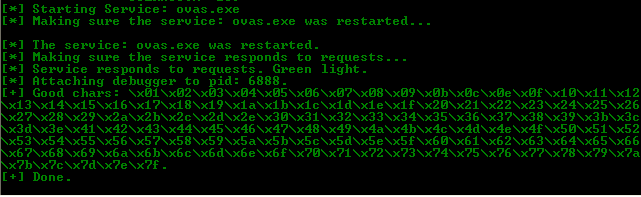
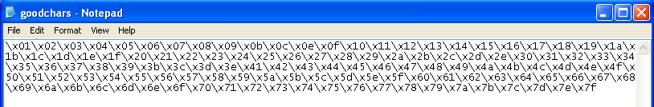
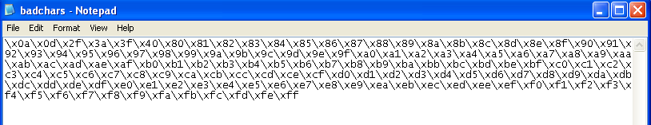

## Description
It iterates all characters starting from `00` to `FF` and try to identify good and bad chars for that specific software and output the results to their corresponding files.

### Dependency
- environment: win32 python 2.7 x86
- download the `dependency.zip` file.
- extract the `pydbg.zip` inside your python `lib\site-packages` directory.
- install `pywin32-218.win32-py2.7.exe` and `WMI-1.4.9.win32.exe`.

### Sample Output

