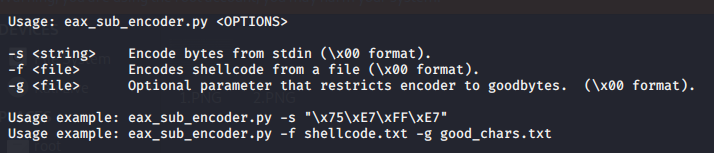
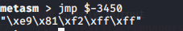
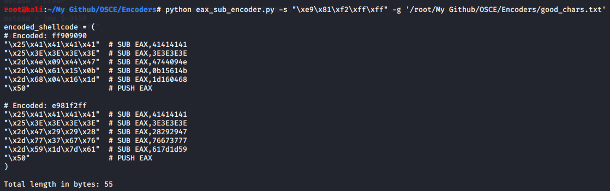

## Description
`eax_sub_encoder.py`

This script works by taking the original shellcode and breaking it down into sets of 4 bytes. Following that it will proceed to “carve” these bytes into the EX register. 
It does this by reading in the shellcode backwards 4 bytes at a time, zeroing out the EAX register and then performs the relevant hex calculations so that when done, EAX is equal to these bytes.
Once done it will push EAX onto the stack. 
NOTE: You will still need to align the stack to point to the beginning of the encoded output

### Usage
```
Usage: eax_sub_encoder.py <OPTIONS>

 -s <string>    Encode bytes from stdin (\x00 format).
 -f <file>      Encodes shellcode from a file (\x00 format).
 -g <file>      Optional parameter that restricts encoder to goodbytes.  (\x00 format).

 Usage example: eax_sub_encoder.py -s "\x75\xE7\xFF\xE7"
 Usage example: eax_sub_encoder.py -f shellcode.txt -g good_chars.txt

```

### Sample Output

Usage

Payload to be encoded

Output of script


