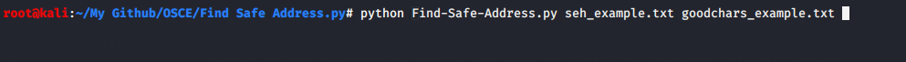
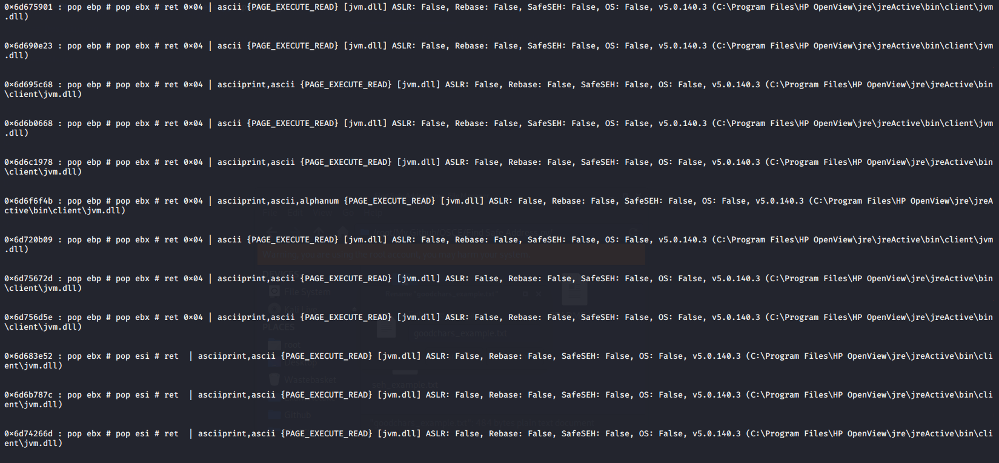

## Description
`find_safe_address.py` parses seh.txt generated by mona.py and helps to find a bad character friendly address.

### Usage
```
usage: find_safe_address.py [-h] -r  -g

find safe/ good return address

optional arguments:
  -h, --help            show this help message and exit
  -r , --return_address 
                        provide a text file containing all return addresses
  -g , --good_characters 
                        provide a text file containing all good characters

sample:
python find_safe_address.py -r address.txt -g good_chars.txt
```

### Sample Output




